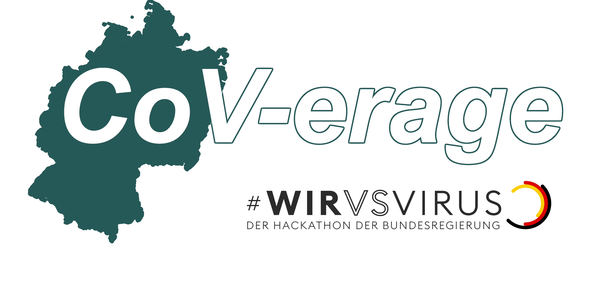
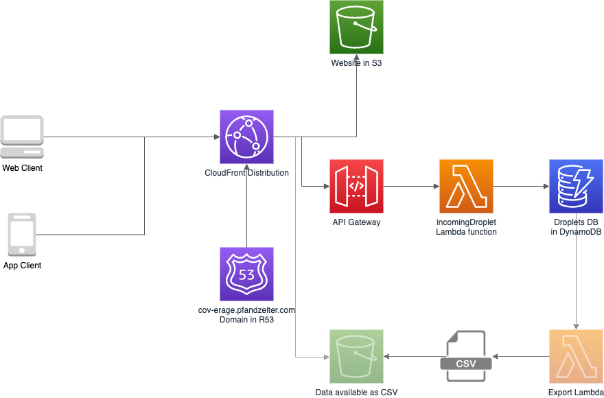

Jetzt anschauen auf [cov-erage.pfandzelter.com](https://cov-erage.pfandzelter.com)!

Hinterlasst auch gerne ein Like auf [DevPost](https://devpost.com/software/mobile-corona-computing).

Entstanden im Rahmen des [#WirVsVirus Hackathon](https://www.wirvsvirushackathon.org).

Android-App (Prototyp) verfügbar unter [/CoV-Erage-Android/CoV-erage.apk](/CoV-Erage-Android/CoV-erage.apk).

## Inspiration
Die Anzahl der bestätigten COVID-19-Fällen, d.h. die an die Behörden gemeldeten positiven Laborergebnisse, umfasst nur einen Bruchteil der tatsächlich infizierten Menschen, da viele Menschen mit nur geringen Symptomen zu Hause bleiben und sich dort auskurieren. Um einen umfassenden Überblick über die Gesundheitssituation zu erhalten, müssen jedoch auch diese Menschen ins Lagebild aufgenommen werden. Dafür benötigen wir eine leicht zugängliche Ergänzungen zu bestehenden offiziellen Meldesystemen zur direkten und  freiwilligen Selbstmeldung von Symptomen, ggfs. auch für Personen aus der eigenen Familie.

Wir wollen eine Plattform erstellen, die den Menschen anonyme Selbstmeldungen bestimmter Symptome der CoViD-19-Erkrankung sowie positiver Testergebnisse (bestätigter CoViD-19-Erkrankungen) ermöglicht und diese sammelt. Die so gesammelten Daten können dann entweder als Teil dieses Projektes oder durch andere Projekte analysiert werden, um die Ergebnisse der Öffentlichkeit zugänglich zu machen.

Wichtig ist: jeder kann mitmachen (Crowdsourcing!), egal ob krank oder kerngesund. So soll schnell ein allgemeiner und grober Überblick zur aktuellen Situation in Deutschland entstehen. Fragen, die die Plattform beantworten soll, sind:

Wie ist der allgemeine Gesundheitszustand der Bevölkerung in welchen Gebieten (nach PLZ)?
Wo haben aktuell besonders viele Personen einschlägige Symptome (z.B. Husten, Fieber, etc..)?

Die Beantwortung dieser Fragen hilft nicht nur der Regierung und der Wissenschaft, sondern auch jedem Einzelnen. Statt alleine zu Hause zu sein und nicht wirklich zu wissen, wie es den anderen Menschen in der Nähe geht, kann man sich mit diesen Daten einen einfachen Überblick verschaffen. Durch die tägliche Kurzumfrage kann Menschen, die momentan nur wenig beitragen können, auf einfache Weise die Möglichkeit gegeben werden, einen eigenen Beitrag im Kampf gegen das Coronavirus zu leisten.

## Was haben wir gebaut?
Per IOS/Android oder Web-App können Bürgerinnen und Bürger einmal täglich eine Kurzumfrage zu ihrem aktuellen Gesundheitszustand anonym übermitteln. Diese Daten werden zentral gespeichert und können auf verschiedene Weisen ausgewertet werden. Neben der Übermittlung der Kurzumfragen können über die App auch verschiedene Visualisierungen der Daten angezeigt werden; z.B. wie viel Prozent der Menschen im gleichem Postleitzahlgebiet gerade an Husten leiden.

## Wie sind wir vorgegangen?
Wir haben erst durch diesen Hackathon angefangen, über dieses Problem und eine Lösung nachzudenken. Basierend auf den Ideen, welche wir Airtable entnommen haben (insbesondere der "DarkCor" Idee), haben wir als Team dann den hier präsentierten Lösungsvorschlag entwickelt.

Neben Brainstorming und ausführlichen Google Hangout Sessions, besteht unser Erfolgsrezept aus: Rapid Prototyping mit XCode/SwiftUI, Android Studio, AWS Lambda, Node.js, Vue.js, DynamoDB.

## Was für Probleme hatten wir?
Das übliche, wenn man neue Technologien nutzt: Dinge funktionieren nicht so wie man es erwartet hätte.

## Worauf sind wir besonders stolz?
Dass CoV-erage wichtige Informationen zur Erstellung eines umfassenden Lagebildes beitragen kann, und wie schnell wir einen ersten Prototypen für die wichtigsten Plattformen fertig gestellt hatten.

## Wie kann das Projekt erweitert werden
Obwohl wir schon viel entwickelt haben, können all unsere Anwendungen noch definitiv gut erweitert werden, z.B.:

### Kurzumfrage erweitern (mehr Symptome, etc)
Auswertungsdashboard direkt in der App und auf der Webseite
Veröffentlichung in den App Stores (wir haben keinen Accounts)
Mehrere Personen eintragen pro App (Family Account)
Hinweis geben -> dies ist keine medizinische App, bei Krankheit an Ärzte etc. wenden
Auch langfristig ist sicher noch viel zu holen. Beispielsweise könnten automatisiert, basierend auf den Kurzumfragen, Empfehlungen an die Teilnehmenden ausgesprochen werden (geh zum Arzt, ruh dich aus, ...). Damit würden wir einen Ansatz der Charité erweitern. Wir haben noch viele weitere Ideen, sprecht uns an :)!

### Synergien mit anderen Projekten
Da alle Projekte dieses Hackathons darauf ausgelegt sind, etwas gegen den Coronavirus zu unternehmen, gibt es unterschiedlichste Möglichkeiten voneinander zu profitieren. Zum Beispiel möchte das Lockdown Projekt Ausgangsbeschränkung per Internetplattform und App koordinieren. Mit den von uns gesammelten Daten, können solche Entscheidungen viel präziser getroffen werden.

## AWS Architektur

